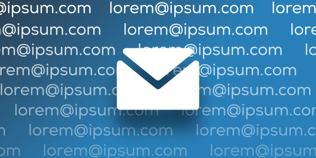

  

This Figma plugin generates random email addresses from text. Simply select your text, and run the plugin.

Authors: Caleb Faulkner and Caleb Dawson

You can run the plugin in Figma <a href="https://www.figma.com/community/plugin/1109344197084586587" target="blank">here</a>

